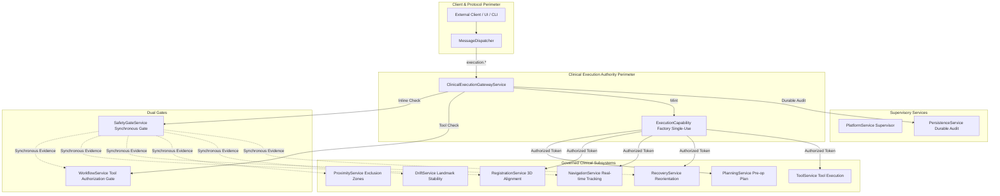

# M25_DISCOVERY_REPORT: POST-M24 ARCHITECTURE AUDIT

**Authoritative Baseline**: `8ad002ca58fb1d41c53a052345fb7c23d3e54d13`  
**Audit Mode**: READ-ONLY  
**Status**: DISCOVERY COMPLETE  

---

## 1. Baseline Verification
- `git rev-parse HEAD`: `8ad002ca58fb1d41c53a052345fb7c23d3e54d13`
- `git status --short`: Empty (working tree clean)
- `git log -1 --oneline`: `8ad002c feat(M24): harden preoperative planning execution`
- Clean baseline verified.

---

## 2. System Authority Map



---

## 3. Privileged Mutation Inventory

| Entrypoint / Method | Subsystem / Owner | Dispatcher Route | M18 Gate | M10 Gate | Capability Required | Classification |
| :--- | :--- | :--- | :--- | :--- | :--- | :--- |
| `execute_navigation` | M19 / Gateway | `execution.navigation.execute` | `TOOL_NAVIGATION` | Evaluated | Yes (`TOOL_NAVIGATION`) | **PROTECTED** |
| `execute_recovery` | M19 / Gateway | `execution.recovery.execute` | `SPATIAL_REORIENTATION` | Evaluated | Yes (`RECOVERY_COORDINATION`) | **PROTECTED** |
| `execute_trajectory_bind`| M19 / Gateway | `execution.trajectory.bind` | `TRAJECTORY_ALIGNMENT` | Evaluated | Yes (`TRAJECTORY_SELECTION`) | **PROTECTED** |
| `execute_tool` | M19 / Gateway | `execution.tool.invoke` | `TOOL_INVOCATION` | Evaluated | Yes (`TOOL_EXECUTION`) | **PROTECTED** |
| `execute_workflow_resume`| M19 / Gateway | `execution.workflow.resume` | `WORKFLOW_RESUMPTION` | Evaluated | Yes (`WORKFLOW_RESUMPTION`) | **PROTECTED** |
| `execute_registration` | M19 / Gateway | `execution.registration.execute` | `TRAJECTORY_ALIGNMENT` | Evaluated | Yes (`REGISTRATION_ALIGNMENT`) | **PROTECTED** |
| `execute_planning` | M19 / Gateway | `execution.planning.execute` | `TRAJECTORY_ALIGNMENT` | Evaluated | Yes (`PLANNING_COORDINATION`) | **PROTECTED** |
| `submit_plan` | M12 / Planning | None (Unroutable) | Indirect (M19) | Indirect (M19) | Yes (`PLANNING_COORDINATION`) | **PROTECTED** |
| `lock_plan` | M12 / Planning | None (Unroutable) | Indirect (M19) | Indirect (M19) | Yes (`PLANNING_COORDINATION`) | **PROTECTED** |
| `verify_plan` | M12 / Planning | None (Unroutable) | Indirect (M19) | Indirect (M19) | Yes (`PLANNING_COORDINATION`) | **PROTECTED** |
| `submit_fiducials` | M13 / Registration | None (Unroutable) | Indirect (M19) | Indirect (M19) | Yes (`REGISTRATION_ALIGNMENT`) | **PROTECTED** |
| `solve_registration` | M13 / Registration | None (Unroutable) | Indirect (M19) | Indirect (M19) | Yes (`REGISTRATION_ALIGNMENT`) | **PROTECTED** |
| `verify_registration` | M13 / Registration | None (Unroutable) | Indirect (M19) | Indirect (M19) | Yes (`REGISTRATION_ALIGNMENT`) | **PROTECTED** |
| `bind_trajectory` | M14 / Navigation | None (Unroutable) | Indirect (M19) | Indirect (M19) | Yes (`TRAJECTORY_SELECTION`) | **PROTECTED** |
| `submit_pose` | M14 / Navigation | None (Unroutable) | Indirect (M19) | Indirect (M19) | Yes (`TOOL_NAVIGATION`) | **PROTECTED** |
| `stage_recovery` | M17 / Recovery | None (Unroutable) | Indirect (M19) | Indirect (M19) | Yes (`RECOVERY_COORDINATION`) | **PROTECTED** |
| `verify_recovery` | M17 / Recovery | None (Unroutable) | Indirect (M19) | Indirect (M19) | Yes (`RECOVERY_COORDINATION`) | **PROTECTED** |
| `activate_recovery` | M17 / Recovery | None (Unroutable) | Indirect (M19) | Indirect (M19) | Yes (`RECOVERY_COORDINATION`) | **PROTECTED** |
| `invoke_tool` | M07 / Tools | None (Unroutable) | Indirect (M19) | Indirect (M19) | Yes (`TOOL_EXECUTION`) | **PROTECTED** |
| `start_workflow` | M10 / Workflow | `workflow.start` | None | Self (M10) | None | **CONDITIONALLY PROTECTED** (Workflow start only) |
| `transition_phase` | M10 / Workflow | `workflow.transition` | None | Self (M10) | None | **CONDITIONALLY PROTECTED** (Interlocks + Confirmations) |
| `confirm` | M10 / Workflow | `workflow.confirm` | None | Self (M10) | None | **CONDITIONALLY PROTECTED** (Operator response) |
| `abort_workflow` | M10 / Workflow | `workflow.abort` | None | Self (M10) | None | **CONDITIONALLY PROTECTED** (Fail-closed transition) |
| `start_session` | M09 / Platform | `platform.session.start` | None | None | None | **CONDITIONALLY PROTECTED** (M09 SessionManager only) |
| `stop_session` | M09 / Platform | `platform.session.stop` | None | None | None | **CONDITIONALLY PROTECTED** (M09 SessionManager only) |
| `migrate_epoch` | M09 / Platform | `platform.reset` | None | None | None | **CONDITIONALLY PROTECTED** (Supervisor epoch only) |
| `service.clear()` | Multiple (M10-M24) | None (In-memory) | None | None | None | **BYPASS (IN-MEMORY)** (No capability check on clear) |

---

## 4. Dispatcher Inventory Audit
Total routes registered across the repository:
- **Execution Commands (7)**:
  - `execution.navigation.execute`
  - `execution.recovery.execute`
  - `execution.trajectory.bind`
  - `execution.tool.invoke`
  - `execution.workflow.resume`
  - `execution.registration.execute`
  - `execution.planning.execute`
- **Synchronous Evaluators (3)**:
  - `safety_gate.evaluate`
  - `proximity.evaluate`
  - `drift.evaluate`
- **Workflow Commands (4)**:
  - `workflow.start`
  - `workflow.transition`
  - `workflow.confirm`
  - `workflow.abort`
- **Platform Lifecycle Commands (4)**:
  - `platform.cycle`
  - `platform.session.start`
  - `platform.session.stop`
  - `platform.reset`
- **Peripheral & Transport Commands (4)**:
  - `gateway.disconnect`
  - `device.orchestration.sync`
  - `device.coordination.snapshot`
  - `persistence.replay`
- **Peripheral Reset Commands (7)**:
  - `tools.reset`, `audio.pipeline.reset`, `vision.pipeline.reset`, `gesture.pipeline.reset`, `anatomy.reset`, `xr.reset`, `ultron.reset`
- **Queries (28)**:
  - All registered via `register_query_handler` and strictly read-only.
- **Audit Findings**:
  - No raw clinical mutation routes (`planning.submit`, `registration.submit_fiducials`, `navigation.pose.submit`, `recovery.stage`, `tools.invoke`) exist on the dispatcher. All clinical mutations are channeled strictly through `execution.*`.
  - Non-execution commands are restricted to workflow coordination, platform supervisor lifecycle, and peripheral test resets.

---

## 5. Public API Bypass Sweep
- Direct inspection of all public methods on clinical services:
  - All mutating methods on `PlanningService`, `RegistrationService`, `NavigationService`, `RecoveryService`, `ToolService` require an active `_ExecutionCapability`.
  - Direct calls without a valid, matching capability immediately raise `*AuthorizationError`.
- **Identified Bypass / In-Memory Weakness**:
  - Public `clear()` methods on `WorkflowService`, `PlanningService`, `RegistrationService`, `NavigationService`, `RecoveryService`, `SafetyGateService`, and `ClinicalExecutionGatewayService` have no authorization check and can be invoked while `_state == ServiceState.STARTED`.
  - Calling `clear()` on any service mid-procedure immediately wipes session state, causing subsequent operations to fail closed or raise errors.
  - While not exposed over the dispatcher, this is an in-memory boundary gap.

---

## 6. State Ownership Audit

| State Entity | Authoritative Owner | Authoritative Writers | Readers | Lifecycle Invalidation / Cleanup |
| :--- | :--- | :--- | :--- | :--- |
| `SurgicalPlanDefinition` | M12 `PlanningService` | M19 (via Capability) | M13, M14, M18, Gateway | `PlanningService.clear()` only |
| `RegistrationStatusRecord` | M13 `RegistrationService`| M19 (via Capability) | M14, M18, Gateway | `RegistrationService.clear()` only |
| `TrackedInstrumentPose` | M14 `NavigationService` | M19 (via Capability) | M18, Gateway | `NavigationService.clear()` only |
| `TrajectoryDeviation` | M14 `NavigationService` | M19 (via Capability) | M18, Gateway | `NavigationService.clear()` only |
| `RecoveryStatusRecord` | M17 `RecoveryService` | M19 (via Capability) | M18, Gateway | `RecoveryService.clear()` only |
| `GateStatusRecord` | M18 `SafetyGateService` | M18 `SafetyGateEvaluator` | M19 Gateway, Dispatcher | `SafetyGateService.clear()` only |
| `WorkflowStateMachine` | M10 `WorkflowService` | M10 `WorkflowService` | M18, M19 Gateway | `WorkflowService.clear()` only |
| `SafetyInterlock` | M10 `WorkflowService` | M10 `SafetyInterlockEngine`| M18, M19 Gateway | `WorkflowService.clear()` only |
| `SessionContext` | M09 `PlatformService` | M09 `SessionManager` | PlatformService | `SessionManager.reset()` only |
| `ExecutionStatus` Cache | M19 `ExecutionGateway` | M19 `ExecutionGateway` | Gateway Query | `ExecutionGateway.clear()` only |

---

## 7. Session Lifecycle Audit: The Primary Architectural Gap

### Critical Finding: Absence of Coordinated Session Teardown
1. **Isolated Platform Session Teardown**:
   - When a session ends or stops, `PlatformService.stop_session(session_id)` is invoked.
   - `PlatformService` ONLY updates its internal `_session_manager.stop_session(session_id)`.
   - It emits **zero events** and coordinates with **zero downstream clinical services**.
2. **Disconnected Workflow Abort / Completion**:
   - When `workflow.abort(session_id)` is called, `WorkflowStateMachine` transitions to `ABORTED` and emits `workflow.aborted`.
   - **None of the clinical subsystems** (`RegistrationService`, `NavigationService`, `PlanningService`, `RecoveryService`, `SafetyGateService`, `ExecutionGateway`) subscribe to or handle `workflow.aborted` or `workflow.completed`.
3. **Session Cache Accumulation & Permanent DoS**:
   - `WorkflowService`: `_workflows` stores state machines up to `MAX_ACTIVE_WORKFLOWS` (32).
   - `PlanningService`: `_session_plan_bindings` stores bindings up to `MAX_ACTIVE_PLANS` (32).
   - `RegistrationService`: `_registrations` stores registrations up to `MAX_ACTIVE_REGISTRATIONS` (32).
   - `NavigationService`: `_session_states` stores sessions up to `MAX_ACTIVE_NAVIGATION_SESSIONS` (32).
   - `RecoveryService`: `_session_states` stores sessions up to `MAX_ACTIVE_RECOVERIES` (32).
   - `SafetyGateService`: `_latest_decisions` stores decisions up to `MAX_ACTIVE_GATE_SESSIONS` (32).
   - `ClinicalExecutionGatewayService`: `_latest_results` and `_persisted_states` accumulate sessions indefinitely.
   - **Consequence**: After 32 procedures or sessions are run, the platform exhausts session capacity across multiple services, raising `*CapacityError` and permanently preventing any new clinical session from starting, unless the entire process is restarted or global `clear()` is invoked.
4. **Cross-Session Leakage Risk**:
   - If a `session_id` is restarted or reused, stale registrations, stale plans, or stale safety decisions from the prior lifecycle remain present in the services' transient memory until overwritten.

---

## 8. Epoch Architecture Audit
- **Supervisor Isolation in M09**:
  - `PlatformService.migrate_epoch(target_epoch_id)` was designed in M09.
  - Its hardcoded reset list is:
    `epoch_aware_order = ("tool_service", "xr_service", "anatomy_service", "ultron_service")`.
  - M10 `WorkflowService`, M12 `PlanningService`, M13 `RegistrationService`, M14 `NavigationService`, M15 `ProximityService`, M16 `DriftService`, M17 `RecoveryService`, M18 `SafetyGateService`, M19-M24 `ClinicalExecutionGatewayService` are completely absent from `epoch_aware_order`.
- **Fail-Closed Assessment**:
  - Because every clinical service stores `self._epoch_id` (set at `initialize()`) and strictly rejects requests where `request.epoch_id != self._epoch_id`, migrating the platform epoch causes all clinical commands under the new epoch to immediately fail with `*EpochMismatchError`.
  - This behavior is **SAFE FAIL-CLOSED** (it never allows mismatched execution), but renders runtime epoch migration operationally destructive to the clinical execution perimeter.

---

## 9. Revision & Freshness Audit
- Plan version, registration revision, landmark revision, zone revision, and recovery revisions are evaluated synchronously during M18 and M19 dual-gate cycles.
- TOCTOU windows between evaluation and execution are mitigated by:
  - Single-threaded synchronous transaction serialization (`_in_transaction`).
  - Short-lived single-use capabilities invalidated immediately in `finally:`.
  - Precedence ordering in M18 evaluator.

---

## 10. M18 Safety Coverage Audit
- All 7 `SafetyGateAction` enum values:
  1. `TOOL_NAVIGATION`: Governs real-time tracking in M14.
  2. `TRAJECTORY_ALIGNMENT`: Governs planning, registration, and trajectory binding.
  3. `TOOL_INVOCATION`: Governs M07 tool invocation.
  4. `SPATIAL_REORIENTATION`: Governs M17 recovery staging, verification, and activation.
  5. `RECOVERY_REORIENTATION`: Internal reorientation path.
  6. `WORKFLOW_RESUMPTION`: Governs transition from `RECOVERY_REQUIRED` to `NAVIGATION`.
  7. `SYSTEM_RESET`: Available for system-level clearing.
- No unused actions, no unmapped operations. Full semantic coverage.

---

## 11. M10 Workflow Authority Audit
- Workflow phase transitions are strictly mediated by `ClinicalWorkflowStateMachine`.
- Only legal transitions per `LEGAL_TRANSITIONS` graph are permitted.
- Human confirmation gates are enforced prior to phase advancement.
- Tool safety classifications are reconciled against frozen M07 rules.

---

## 12. Recovery & Spatial Authority Audit
- M22 and M23 hardening remains completely intact.
- Spatial recovery staging, verification, and activation require active `RECOVERY_COORDINATION` capabilities.
- Trajectory binding requires active `TRAJECTORY_SELECTION` capabilities.
- Registration requires active `REGISTRATION_ALIGNMENT` capabilities.

---

## 13. Persistence & Audit Audit
- All 7 execution routes in `ClinicalExecutionGatewayService` record durable audit records to `PersistenceService.record_audit`.
- Audit records capture:
  - Permitted execution (`*_executed`)
  - Gate denial (`*_blocked_safety_gate`)
  - Workflow denial (`*_blocked_workflow`)
  - Runtime exceptions (`*_execution_failed`)
- Payloads are redacted via `SecretFilter` before recording.

---

## 14. Fail-Closed & Exception Handling Audit
- In `ClinicalExecutionGatewayService`:
  - Missing services fail closed (`DENIED_INTERLOCKED`).
  - Exceptions during planning, registration, navigation, recovery, or tools are caught, sanitized, recorded to audit, and return `FAILED_NAVIGATION_GEOMETRY` or error envelopes.
  - Capabilities are unconditionally invalidated in `finally:` blocks.
- Zero default permits. Zero silent error swallowing.

---

## 15. Concurrency & Reentrancy Audit
- All services implement `_in_transaction` boolean guards.
- Reentrant calls during active execution are immediately rejected with `*LifecycleError`.
- System relies on single-threaded synchronous message dispatcher execution. Not thread-safe for multi-threaded access, but strictly reentrancy-safe.

---

## 16. Capability Boundary Integrity
- `_ExecutionCapability` is a private, unforgeable class instantiated strictly via `_create_execution_capability` inside `ClinicalExecutionGatewayService`.
- Capabilities are non-serializable, single-use, bound to `(session_id, action, sequence_number, service_instance_id)`, and destroyed in `finally:` blocks.
- No capability leak detected.

---

## 17. Test Coverage Audit
- Total test suite: 1,530 passed tests across unit and adversarial suites.
- Coverage includes:
  - Dispatcher routing isolation
  - Direct capability bypass rejection (all 9 failure modes)
  - Gate short-circuiting
  - Persistence audit recording
  - Reentrancy protection
- Gap in tests: Multi-session lifecycle progression across all 32 session slots and teardown propagation currently lack end-to-end integration tests.

---

## 18. Frozen Milestone Integrity
- M09 Platform: UNTOUCHED
- M10/M20 Workflow: UNTOUCHED
- M11 Gateway: UNTOUCHED
- M13 Registration: UNTOUCHED
- M14 Navigation: UNTOUCHED
- M15 Proximity: UNTOUCHED
- M16 Drift: UNTOUCHED
- M17 Recovery: UNTOUCHED
- M18 Safety Gate: UNTOUCHED
- M08 Persistence: UNTOUCHED

---

## 19. Remaining Genuine Gaps

### Gap 1: Coordinated Clinical Session Teardown & Lifecycle Invalidation
- **Severity**: **CRITICAL**
- **Evidence**:
  - `PlatformService.stop_session` only updates `SessionManager` and emits no event.
  - `WorkflowService.abort_workflow` sets phase `ABORTED` but never notifies M12, M13, M14, M17, M18, M19.
  - Active session caches in all clinical subsystems grow monotonically until reaching `MAX_ACTIVE_*` (32), causing permanent denial of service.
  - Reused session IDs risk cross-session state leakage.
- **Affected Milestones**: M09, M10, M12, M13, M14, M17, M18, M19-M24.
- **Why M24 Did Not Solve It**: M24 strictly scoped hardening to M12 preoperative planning operations (`submit`, `lock`, `verify`).

### Gap 2: Epoch Migration Desynchronization
- **Severity**: **HIGH**
- **Evidence**: `PlatformService.migrate_epoch()` only updates M01-M08 services. Clinical subsystems (M10-M24) are not updated, causing all subsequent operations under the new epoch to fail closed.
- **Affected Milestones**: M09, M10, M12-M19.
- **Why M24 Did Not Solve It**: M09 is frozen; M24 did not modify supervisor epoch migration.

### Gap 3: Public `clear()` In-Memory Bypass Exposure
- **Severity**: **MEDIUM**
- **Evidence**: `service.clear()` can be called directly on running services without capability or lifecycle validation.
- **Affected Milestones**: M10, M12, M13, M14, M17, M18, M19.

### Gap 4: Workflow Phase Transition Dispatcher Route Isolation
- **Severity**: **MEDIUM**
- **Evidence**: `workflow.transition` is exposed directly on the message dispatcher without routing through the execution gateway.
- **Affected Milestones**: M10, M19.

---

## 20. Candidate Ranking

1. **Rank 1 (CRITICAL)**: **Coordinated Clinical Session Teardown & Lifecycle Invalidation**
2. **Rank 2 (HIGH)**: Epoch Migration Desynchronization
3. **Rank 3 (MEDIUM)**: Public `clear()` In-Memory Bypass Hardening
4. **Rank 4 (MEDIUM)**: Workflow Phase Transition Dispatcher Route Isolation

---

## 21. Highest-Priority M25 Candidate: Coordinated Clinical Session Teardown & Lifecycle Invalidation

### Problem Definition
The system lacks an authoritative, cross-subsystem session teardown lifecycle. When a surgical session completes, aborts, or is terminated by the platform supervisor, session-scoped clinical state (plans, fiducials, registrations, navigation poses, bound trajectories, recovery states, safety decisions, and sequence counters) remains resident in the in-memory caches of M12, M13, M14, M17, M18, and M19. After 32 clinical sessions, the system hits hard limits and locks up.

### Architectural Comparison

#### Architecture A: Gateway-Mediated Synchronous Teardown Protocol (Recommended)
- **Concept**:
  - Introduce `execution.session.teardown` on `ClinicalExecutionGatewayService`.
  - When invoked (or when workflow aborts / platform stops session), the gateway coordinates synchronous, ordered session teardown across:
    1. `NavigationService.teardown_session(session_id)`
    2. `RecoveryService.teardown_session(session_id)`
    3. `RegistrationService.teardown_session(session_id)`
    4. `PlanningService.teardown_session(session_id)`
    5. `SafetyGateService.teardown_session(session_id)`
    6. `WorkflowService.teardown_session(session_id)`
    7. `ExecutionGateway.teardown_session(session_id)`
  - Records a durable persistence audit: `session_teardown_completed`.
  - Mints an explicit single-use `SESSION_TEARDOWN` capability to authorize teardown hooks.
- **Strengths**:
  - Deterministic, synchronous, fail-closed.
  - Preserves frozen boundaries by adding non-breaking `teardown_session` methods or capability-governed cleanup.
  - Prevents resource exhaustion across all 32-session capacity limits.
  - Completely eliminates cross-session leakage.

#### Architecture B: Event-Driven Dispatcher Broadcast Teardown
- **Concept**:
  - `PlatformService` and `WorkflowService` emit `session.teardown` / `workflow.aborted` events over the dispatcher.
  - Each clinical service subscribes to the event and clears its own session dictionary asynchronously.
- **Weaknesses**:
  - Asynchronous and non-deterministic.
  - No transactional confirmation that all services successfully released session state.
  - If a message is delayed or dropped, state diverges across subsystems.

---

## 22. Selected Architecture
**Architecture A: Gateway-Mediated Synchronous Session Teardown** under `ClinicalExecutionGatewayService`.

### Minimum Reopen Set
- `M19-M25 Execution Gateway` (`python/holomed/execution/*`)
- Session teardown hooks in `PlanningService`, `RegistrationService`, `NavigationService`, `RecoveryService`, `SafetyGateService`, and `WorkflowService`.

---

## 23. M25 Feasibility
- **Feasibility Status**: **READY FOR FEASIBILITY ANALYSIS / CONTRACT DESIGN**
- The gap is real, directly reproducible, and represents the final major architectural vulnerability in the multi-session clinical execution lifecycle.

---

## 24. Final Classification

```
==================================================
M25_JUSTIFIED_AND_FEASIBLE
==================================================
```
