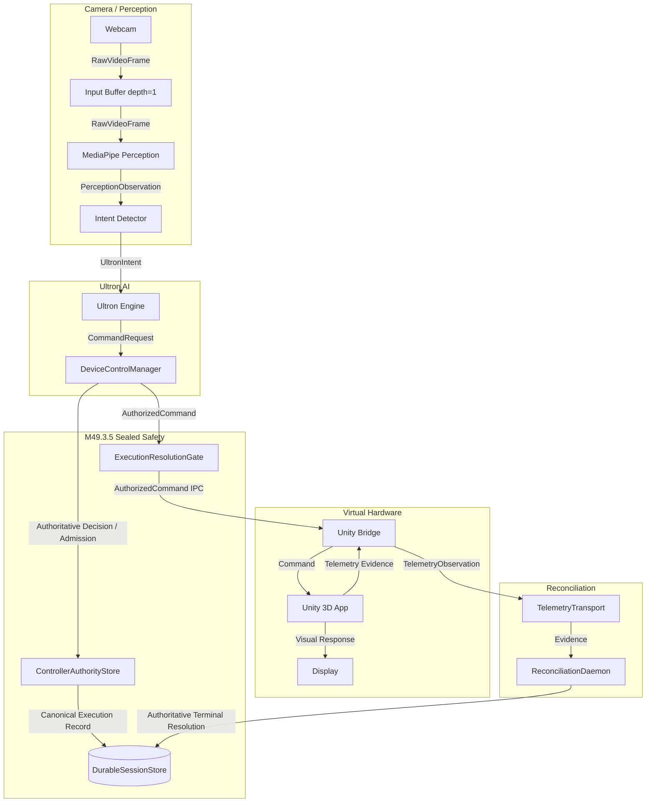

# M49 First Live HoloMedAI Vertical Slice Architecture (Revised)
**Status:** ARCHITECTURE REVIEW
**Scope:** Software-Only Live Loop (Laptop Camera → AI → Unity 3D Heart)
**First Slice Scope:** Grasp/hand interaction intent only.

---

## A. Final Data-Flow Diagram

---

## B. Component Responsibility Table

| Component | Responsibility |
| :--- | :--- |
| **CameraInputNode** | Bounded frame acquisition, backpressure, reconnect. |
| **PerceptionEngine** | 3D Landmark extraction, intrinsic confidence scoring. |
| **IntentDetector** | Smooth raw landmarks into bounds, emit debounced Intents. Manage tracking loss semantics. |
| **Ultron Engine** | Map validated intent to a `CommandRequest` proposal. Never unilaterally acts. |
| **DeviceControlManager** | Authoritative command admission, capability/identity authorization, session recording. |
| **ExecutionResolutionGate** | Lifecycle resolution role for authorized commands. Dispatches to transport. |
| **UnityBridge / App** | Consumes authorized commands, executes visuals, returns software execution evidence. **Never an authority.** |
| **ReconciliationDaemon** | Validates telemetry evidence against invariants (G13). Determines if evidence becomes durable authoritative resolution. |

---

## C. Data Contracts

1. **`RawVideoFrame`**: `(capture_timestamp_ns, frame_sequence, data, resolution)`
2. **`PerceptionObservation`**: `(capture_timestamp_ns, perception_timestamp_ns, correlation_id, landmarks, confidence)`
3. **`UltronIntent`**: `(correlation_id, intent_timestamp_ns, action="GRASP", value, confidence)`
4. **`CommandRequest`**: `(correlation_id, command_timestamp_ns, device_id="unity_heart_sim", action, payload)`
5. **`AuthorizedCommand`**: Includes canonical identity `(device_id, device_epoch, controller_epoch, physical_operation_id, command_nonce)`.
6. **`TelemetryObservation`**: `(correlation_id, telemetry_timestamp_ns, canonical_identity, status="EXECUTED", evidence_type="DRIVER_ASSERTED_SOFTWARE_EVIDENCE")`

---

## D. Lifecycle State Model (Unity Virtual Device)

The `unity_heart_sim` device strictly adheres to the established software device lifecycle:
1. **Registration**: Virtual device added to durable store.
2. **Device-Domain Initialization**: Assign initial `device_epoch`.
3. **READY Semantics**: Emits readiness telemetry proving it is online and synced to the correct epoch. State transitions to `READY`.
4. **Command Admission**: `DeviceControlManager` admits commands only while `READY`.
5. **Disconnect/Restart**: IPC disconnect transitions state to `UNKNOWN`. Requires epoch increment and re-initialization telemetry to recover.

---

## E. IPC Contract (Unity Bridge)

* **Transport**: Local TCP Socket (or WebSocket).
* **Framing**: Length-prefixed JSON.
* **Schema**: Strict canonical identity inclusion.
* **Correlation ID**: Passed through from intent to telemetry.
* **Timeout**: Short timeout (e.g., 50ms) for command dispatch.
* **Reconnect/Disconnect**: Disconnect invalidates readiness. Reconnect requires a new initialization handshake and epoch sync.
* **Malformed/Duplicate**: Unity drops duplicate nonces and malformed schemas.
* **Stale Handling**: Unity drops commands older than a specific threshold or mismatched epochs.
* **Shutdown Ordering**: Unity receives explicit CANCEL/HALT before socket termination.

---

## F. Timing / Correlation Model

* **Clock**: `time.monotonic_ns()` guarantees monotonic progression without NTP drift.
* **Correlation Chain**: A single `UUIDv7` (or monotonic sequential ID) is generated at the `PerceptionObservation` and carried intact through Intent -> Command -> Telemetry -> Reconciliation.
* **Timestamps captured**: `capture`, `perception`, `intent`, `command`, `execution`, `telemetry`, `reconciliation`.
* **Traceability**: The exact path of a single visual frame can be measured end-to-end.

---

## G. Failure Matrix

| Failure Mode | Visible Behavior | Command Behavior | Durable Behavior | Recovery Behavior |
| :--- | :--- | :--- | :--- | :--- |
| **Camera Unavailable** | UI prompts "Camera Lost" | None | None | Reconnect backoff loop (1s -> 5s). |
| **Camera Disconnect** | UI freezes/fades, prompts | Emits `CANCEL_INTERACTION` | None | Re-initialize stream. |
| **Perception Confidence Loss (Transient)** | Hand overlay flickers | `NO_COMMAND` (debounce) | None | Waits for tracking to stabilize. |
| **Perception Confidence Loss (Sustained)** | Hand overlay fades | Emits `HOLD` / `CANCEL` | Session naturally expires | User must re-enter FOV. |
| **Stale/Duplicate Frame** | None | Dropped by IntentDetector | None | Ignored. |
| **Duplicate Intent** | None | Deduplicated / Rate-Limited | None | Suppressed to prevent network spam. |
| **Duplicate Command** | None | Rejected by Authority/Nonce | Durable record unchanged | Unity/Bridge drop safely. |
| **Authority Rejection** | UI signals "Safety Interlock" | Dropped at `DeviceControlManager` | Fault logged | Requires intent reset. |
| **IPC Timeout / Disconnect** | Unity freezes / UI warns | Dropped at Dispatch | Logged as `FAULTED`/`UNKNOWN` | Unity Virtual Device quarantined. Needs re-init. |
| **Unity Restart** | Unity reloads | Dispatch fails | Device marked `UNKNOWN` | Unity reconnects, syncs device epoch, asserts `READY`. |
| **Stale Unity Telemetry** | None | Rejected by `ReconciliationDaemon` | G13 Fail Closed | Ignored. |
| **Telemetry Timeout** | Heart model stops updating | N/A | Marked `UNKNOWN` / Quarantine | Epoch increments, capability resets. |

---

## H. Test Matrix

1. **Camera Unit Tests**: Assert frame buffering depth=1, stale drop policies, and graceful teardown.
2. **Perception Unit Tests**: Assert MediaPipe confidence thresholds appropriately trigger lost-tracking events.
3. **Intent Unit Tests**: Assert debouncing, transient tracking loss (`NO_COMMAND`), sustained loss (`HOLD`/`CANCEL`), and valid vector bounds.
4. **Authority Integration Tests**: Assert proposed `CommandRequest` correctly validates through `DeviceControlManager` and acquires canonical identity.
5. **IPC Contract Tests**: Assert parsing, canonical ID extraction, timeout drops, and malformed payload rejection.
6. **Unity Bridge Tests**: Assert simulated device lifecycle (Init -> Epoch -> Ready) over local sockets.
7. **Telemetry/Reconciliation Integration**: Assert G13 rejection of forged IPC telemetry and correct resolution of valid IPC telemetry.
8. **Headless E2E Tests**: Inject a pre-recorded `.mp4` into `CameraInputNode` -> trace Correlation ID -> mock Unity IPC -> assert full durable terminal reconciliation.

---

## I. Exact Files & Modules

**New Modules:**
* `holomed/input/camera.py` (Local OpenCV capture, backpressure)
* `holomed/xr/unity_bridge.py` (IPC client/server, virtual driver)
* `tests/unit/input/test_camera.py`
* `tests/unit/xr/test_unity_bridge.py`
* `tests/e2e/test_live_slice_headless.py`

**Modified Modules:**
* `holomed/vision/pipeline.py` (Integrate MediaPipe confidence rules)
* `holomed/ultron/intents.py` (Map Hand landmarks to Grasp)

**Strictly Preserved (Unmodified):**
* `holomed/persistence/authority.py`
* `holomed/devices/control/manager.py`
* `holomed/devices/control/recovery.py`
* `holomed/devices/control/daemon.py`

---

## J. Implementation Order

1. **Test Architecture Setup**: Scaffold unit, integration, and E2E fixtures.
2. **Camera & Perception**: Implement `CameraInputNode` with depth=1 backpressure, integrate MediaPipe confidence handling.
3. **Intent Mapping**: Build debouncing, deduplication, and `HOLD`/`CANCEL` tracking loss semantics.
4. **Unity Virtual Device Lifecycle**: Implement `unity_bridge.py` IPC contract and mock driver emitting `DRIVER_ASSERTED_SOFTWARE_EVIDENCE`.
5. **Authority Hookup**: Connect Ultron proposals to `DeviceControlManager`.
6. **E2E Validation**: Pass headless end-to-end tests ensuring full correlation trace.

---

## K. Acceptance Criteria

1. **Visual Acceptance**: The user can grasp and manipulate the virtual Unity heart smoothly, without perceptible motion-to-photon latency (>150ms).
2. **Durable Reconciliation**: Reconciled state is eventually consistent. Visual feedback is *never* blocked waiting for durable DB writes.
3. **Cadence Control**: Camera runs at 30-60Hz. Command network traffic never exceeds 10Hz (debounced).
4. **Safety Integrity**: `m49.3.5-phase3` safety modules are reused with exactly zero modifications.
5. **Correlation Track**: Every executed command in the `DurableSessionStore` can trace its exact `UUIDv7` correlation ID back to a specific `capture_timestamp_ns`.
6. **Evidence**: Telemetry strictly logs as `DRIVER_ASSERTED_SOFTWARE_EVIDENCE`.
7. **Tracking Loss**: Transient hand occlusions gracefully freeze the interaction without spamming `CommandRequest`s.
